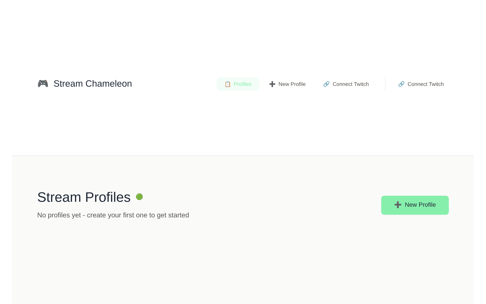

# Stream Chameleon

One-click stream profiles for Twitch. Store the category, title, and tags you use for each recurring format, then apply them to your channel in a single click.

**[Launch the live app](https://stream-chameleon.netlify.app/)** · [Issue tracker](https://github.com/campbellkearns/stream-chameleon/issues)

## What it does

If you stream on a schedule that rotates through recurring formats — a weekly series, game nights, a just-chatting block — you re-enter the same category, title, and tags before every broadcast. Stream Chameleon saves each of those setups as a profile so updating your channel is one action, not three.

- **Profiles** bundle a Twitch category, a title, and up to 10 tags.
- **One click applies the full profile** to your channel through the Twitch Helix API.
- **Title placeholders** — `{YYYY-MM-DD}` and `{DAY}` — resolve to the current date at apply time.
- **Built for speed:** the design target is getting a profile applied in under 10 seconds.

Sign in with Twitch (the app requests a single scope, `channel:manage:broadcast`), create a profile, and apply it whenever you go live.

## Screenshot

The first-run view, before any profiles exist or Twitch is connected:



## Getting started

These steps are for running the app locally. To use Stream Chameleon without setting anything up, just open [the hosted app](https://stream-chameleon.netlify.app/).

The app talks to Twitch directly from your browser, so local development needs a Twitch application of your own.

1. **Register a Twitch application** at [dev.twitch.tv/console/apps](https://dev.twitch.tv/console/apps), and add **both** redirect URIs exactly as written — the app derives its redirect URI from the origin it runs on, and both origins are in play:

   - `http://localhost:5173/auth/callback` — the dev server
   - `https://stream-chameleon.netlify.app/auth/callback` — the hosted deployment

2. **Create your environment file** and set the client ID of the application you just registered:

   ```bash
   cp .env.example .env.local
   ```

   `VITE_TWITCH_CLIENT_ID` is the only required variable. `VITE_API_BASE_URL` and `VITE_DEBUG` are optional (see `.env.example`).

3. **Install and run:**

   ```bash
   npm install
   npm run dev
   ```

   The dev server runs at [http://localhost:5173](http://localhost:5173).

> **A note on ports:** the redirect URI is derived from `window.location.origin`, and Vite's default dev port is 5173. If you run the dev server on a different port, the redirect URI your browser sends won't match the registered one and sign-in breaks — keep the default port or register a matching `http://localhost:<port>/auth/callback` on your Twitch application.

## Scripts

| Command | What it runs |
| --- | --- |
| `npm run dev` | `vite` — dev server at `localhost:5173` |
| `npm run build` | `vite build` — production build |
| `npm run preview` | `vite preview` — serve the production build locally |
| `npm run lint` | `eslint .` |
| `npm test` | `playwright test` — the e2e suite |
| `npm run test:ui` | `playwright test --ui` |
| `npm run test:headed` | `playwright test --headed` |
| `npm run test:debug` | `playwright test --debug` |
| `npm run test:report` | `playwright show-report` |

Coverage, browser projects, and configuration are documented in the [Playwright guide](tests/README.md).

## Architecture

Stream Chameleon is a browser-only app — there is no backend.

- **Twitch is called from the browser.** Applying a profile updates your channel's stream information with a single Helix `PATCH`; nothing is proxied through a server.
- **One scope.** Sign-in uses Twitch's OAuth implicit flow with a public client ID and requests only `channel:manage:broadcast` — the minimum needed to update your channel information.
- **Your data stays on your device.** Your access token and your profiles are stored in IndexedDB in your browser. There is no account system and no server-side copy.
- **PWA, with a known gap.** The app ships a web manifest, and Workbox precaching is configured in `vite.config.ts`, but the service worker is not currently registered (known issue EXE-24, recorded in the [testing guide](tests/README.md)), so features that depend on the service worker aren't active.

## Testing

The Playwright e2e suite runs locally:

```bash
npm test
```

Honest status: `main` carries pre-existing e2e failures (test-code issues) and pre-existing `tsc --noEmit` type errors that don't affect the Vite build. This repository has no CI — the suite runs wherever you run it. The [testing guide](tests/README.md) covers coverage, configuration, and known issues.

## Repository

- **Source:** [github.com/campbellkearns/stream-chameleon](https://github.com/campbellkearns/stream-chameleon)
- **Live app:** [stream-chameleon.netlify.app](https://stream-chameleon.netlify.app/)
